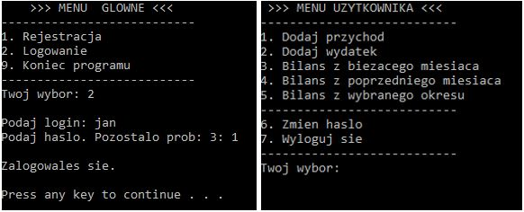
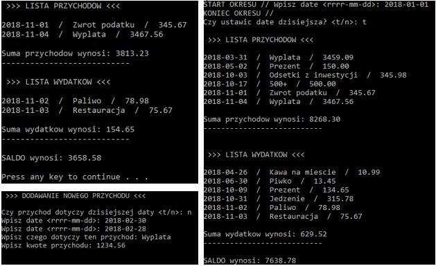

# HomeBudget
> Control home finances by tracking your incomes and expenses!

## Table of contents
* [General info](#general-info)
* [Screenshots](#screenshots)
* [Technologies](#technologies)
* [Setup](#setup)
* [Features](#features)
* [Status](#status)
* [Contact](#contact)

## General info
The program was created to systematize knowledge in the field of C++ and object-oriented programming.  
It uses support for XML files (saving and reading information about users and the flow of money).

## Screenshots

## Technologies
* C++ 14
* CMarkup 11.5

## Setup
Firstly, it is neccesary to create new user by registration.  
Secondly, after login you have access to user menu where you can add incomes and expenses.  
Also you can check the money balance from period which you want.

## Features
> Main Menu  
* User registration  
* User login  
* Exit  
> User Menu  
* Add income  
* Add expense  
* Check money balance in the current month  
* Check money balance in the previous month  
* Check money balance in the selected time period  
* Change password  
* User logout  

## Status
Project is: _finished_  

## Contact
Created by [@KrzysztofKozlowski](https://www.linkedin.com/in/krzysztofkozlowski1/) - feel free to contact me!
